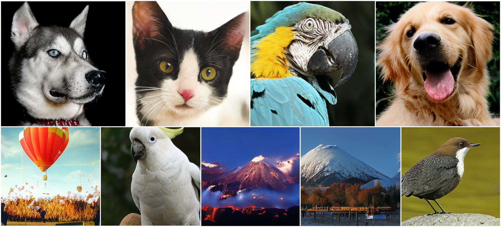

# AiM: Scalable Autoregressive Image Generation with Mamba🐍

<div align="center">

[](https://arxiv.org/abs/)&nbsp;
[](https://huggingface.co/hp-l33/aim)&nbsp;
[](https://colab.research.google.com/drive/1SS1GxzWSRNuvhbqkG9P0oKK3jSiUZHvK#scrollTo=erfdc0bzCk7d)

</div>

<p align="center">

<p>

[AiM: Scalable Autoregressive Image Generation with Mamba]()

## What is AiM
The first, as far as we know, autoregressive image generation model based on Mamba 🐍, offering competitive generation quality 💪 with diffusion models and faster inference speed ⚡️.

We also propose a more general form of adaLN, called **adaLN-group**, which balances parameter count and performance. Notably, adaLN-group can be flexibly converted to adaLN and adaLN-single equivalently.


## Update
* [2040-08-23] Code and Model Release


## Getting Started
### Train


```
accelerate launch --num_processes=32 --num_machines=... --main_process_ip=... --main_process_port=... --machine_rank=... train_stage2.py --aim-model AiM-XL --dataset /your/data/path/ --vq-ckpt /your/ckpt/path/vq_f16.pt --batch-size 64 --lr 8e-4 --epochs 350
```

### Inference
You can play with AiM in the []() or:
```
imgs = model.generate(batch=8, temperature=1, top_p=0.98, top_k=600, cfg_scale=5)
```
The first time Mamba runs, it will invoke the triton compiler and autotune, so it may be slow. See:
> https://github.com/state-spaces/mamba/issues/389#issuecomment-2171755306

## Model Zoo
The model weights can be downloaded from the [](https://huggingface.co/hp-l33/aim).
Model | params | FID | weight 
--- |:---:|:---:|:---:|
AiM-B   | 148M | 3.52 | [aim_b.bin](https://huggingface.co/hp-l33/aim/resolve/main/aim_b.bin)
AiM-L   | 350M | 2.83 | [aim_l.bin](https://huggingface.co/hp-l33/aim/resolve/main/aim_l.bin)
AiM-XL  | 763M | 2.56 | [aim_xl.bin](https://huggingface.co/hp-l33/aim/resolve/main/aim_xl.bin)
